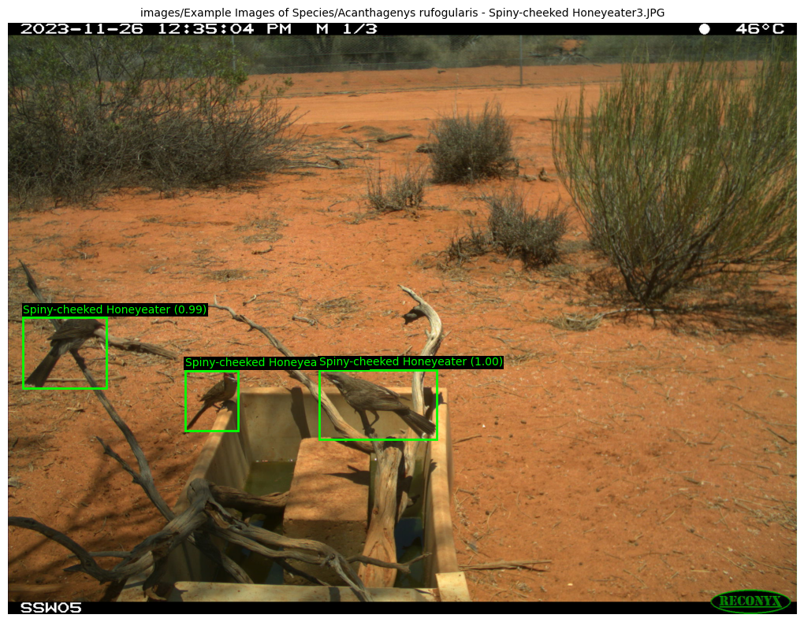
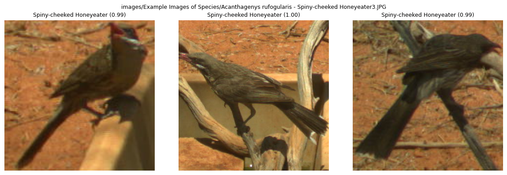

# AWC Helpers - Technical Documentation

This document provides detailed technical documentation for the main classes and functions in the `awc_helpers` library.

## Table of Contents

- [AWCResult](#awcresult)
- [DetectAndClassify](#detectandclassify)
  - [Initialization](#detectandclassify-initialization)
  - [predict()](#detectandclassifypredict)
- [SpeciesClasInference](#speciesclasinference)
  - [Initialization](#speciesclasinference-initialization)
  - [predict_batch()](#speciesclasinferencepredict_batch)
- [Utility Functions](#utility-functions)
  - [get_all_image_paths()](#get_all_image_paths)
  - [visualize_detections()](#visualize_detections)

---

## AWCResult

A frozen dataclass representing a single detection/classification result. Used throughout the library as the standard result container.

```python
from awc_helpers import AWCResult

@dataclass(frozen=True)
class AWCResult:
    identifier: str
    bbox: Tuple[float, float, float, float] = (0.0, 0.0, 0.0, 0.0)
    bbox_label: str = None
    bbox_conf: float = 0.0
    labels_probs: Tuple[Tuple[str, float], ...] = None
```

### Attributes

| Attribute | Type | Description |
|-----------|------|-------------|
| `identifier` | `str` | Image path or custom identifier |
| `bbox` | `Tuple[float, float, float, float]` | Normalized bounding box (x, y, width, height) |
| `bbox_label` | `str` | Detection category label (e.g., 'animal', 'person', 'vehicle') |
| `bbox_conf` | `float` | Detection confidence score |
| `labels_probs` | `Tuple[Tuple[str, float], ...]` | Classification results as tuple of (label, probability) pairs |

### Thread Safety

The `frozen=True` setting makes `AWCResult` immutable and safe to pass between threads. To "modify" a result, use `dataclasses.replace()`:

```python
from dataclasses import replace

original = AWCResult(identifier="image.jpg", bbox_conf=0.95)
updated = replace(original, labels_probs=(("kangaroo", 0.87),))
```

### Example

```python
result = AWCResult(
    identifier="path/to/image.jpg",
    bbox=(0.123, 0.456, 0.234, 0.345),
    bbox_label="animal",
    bbox_conf=0.9234,
    labels_probs=(("kangaroo", 0.8721), ("wallaby", 0.0923))
)

print(result)
# AWCResult(identifier='path/to/image.jpg', bbox=(0.123, 0.456, 0.234, 0.345), bbox_label='animal', bbox_conf=0.9234, labels_probs=(('kangaroo', 0.8721), ('wallaby', 0.0923)))

# Access attributes
print(result.identifier)      # 'path/to/image.jpg'
print(result.labels_probs[0]) # ('kangaroo', 0.8721)
```

---

## DetectAndClassify

End-to-end wildlife detection and classification pipeline that combines MegaDetector for animal detection with a species classifier.

### DetectAndClassify Initialization

```python
DetectAndClassify(
    detector_path: str,
    classifier_path: str,
    label_names: List[str],
    classifier_base: str = 'tf_efficientnet_b5.ns_jft_in1k',
    detection_threshold: float = 0.1,
    clas_threshold: float = 0.5,
    resize_size: int = 300,
    force_cpu: bool = False,
    skip_clas_errors: bool = True
)
```

#### Parameters

| Parameter | Type | Default | Description |
|-----------|------|---------|-------------|
| `detector_path` | `str` | *required* | Path to the MegaDetector model weights (.pt file) |
| `classifier_path` | `str` | *required* | Path to the species classifier weights (.pth file) |
| `label_names` | `List[str]` | *required* | List of species class names matching the classifier output |
| `classifier_base` | `str` | `'tf_efficientnet_b5.ns_jft_in1k'` | Name of the base timm model architecture |
| `detection_threshold` | `float` | `0.1` | Minimum confidence threshold for animal detections |
| `clas_threshold` | `float` | `0.5` | Minimum confidence threshold for classification predictions |
| `resize_size` | `int` | `300` | Target image size for classification model input |
| `force_cpu` | `bool` | `False` | If True, use CPU even if CUDA is available |
| `skip_clas_errors` | `bool` | `True` | If True, skip classification errors instead of raising exceptions |

#### Example

```python
from awc_helpers import DetectAndClassify

pipeline = DetectAndClassify(
    detector_path="models/md_v1000.0.0-redwood.pt",
    classifier_path="models/awc-135-v1.pth",
    label_names=["kangaroo", "wallaby", "wombat", "echidna"],
    detection_threshold=0.1,
    clas_threshold=0.5,
)
```

---

### DetectAndClassify.predict()

Run detection and classification on input images. Processes images through MegaDetector to find animals, then classifies each detected animal using the species classifier.

```python
predict(
    inp: Union[str, Image.Image, List[Union[str, Image.Image]]],
    identifier: Union[str, List[str], None] = None,
    clas_bs: int = 4,
    topn: int = 1,
    filter_category: str = 'animal',
    output_name: str = None,
    show_progress: bool = False
) -> List[AWCResult]
```

#### Parameters

| Parameter | Type | Default | Description |
|-----------|------|---------|-------------|
| `inp` | `str`, `PIL.Image`, or `List` | *required* | Single image or list of images. Can be file paths or PIL Image objects |
| `identifier` | `str`, `List[str]`, or `None` | `None` | Optional identifier(s) for tracking results. If None, uses file paths or timestamps |
| `clas_bs` | `int` | `4` | Batch size for classification inference |
| `topn` | `int` | `1` | Number of top classification predictions to return per detection |
| `filter_category` | `str` | `'animal'` | Category to filter detections by (e.g., 'animal'). None or empty to include all |
| `output_name` | `str` | `None` | If provided, saves results to CSV and JSON files instead of returning |
| `show_progress` | `bool` | `False` | If True, display tqdm progress bars |

#### Returns

`List[AWCResult]` - List of `AWCResult` objects, one per detected animal. See [AWCResult](#awcresult) for details.

#### Example

```python
from awc_helpers import DetectAndClassify

pipeline = DetectAndClassify(
    detector_path="models/md_v1000.0.0-redwood.pt",
    classifier_path="models/awc-135-v1.pth",
    label_names=["kangaroo", "wallaby", "wombat"]
)

# Single image
results = pipeline.predict("path/to/image.jpg")

# Multiple images with progress bar
results = pipeline.predict(
    inp=["image1.jpg", "image2.jpg", "image3.jpg"],
    clas_bs=8,
    topn=2,
    show_progress=True
)

# Save results to file
pipeline.predict(
    inp=["image1.jpg", "image2.jpg"],
    output_name="results"  # Creates results.csv and results.json
)
```

#### Example Output

```python
[
    AWCResult(identifier='path/to/image1.jpg', bbox=(0.123, 0.456, 0.234, 0.345), 
              bbox_label='animal', bbox_conf=0.9234, labels_probs=(('kangaroo', 0.8721),)),
    AWCResult(identifier='path/to/image1.jpg', bbox=(0.567, 0.234, 0.189, 0.278), 
              bbox_label='animal', bbox_conf=0.8567, labels_probs=(('wallaby', 0.7234),)),
    AWCResult(identifier='path/to/image2.jpg', bbox=(0.234, 0.345, 0.156, 0.198), 
              bbox_label='animal', bbox_conf=0.9012, labels_probs=(('wombat', 0.9156),)),
]

# Accessing results
for result in results:
    print(f"{result.identifier}: {result.labels_probs[0][0]} ({result.labels_probs[0][1]:.1%})")
```

---

## SpeciesClasInference

Species classification inference engine for wildlife images. Use this class when you already have bounding boxes from MegaDetector and only need to run classification.

### SpeciesClasInference Initialization

```python
SpeciesClasInference(
    classifier_path: str,
    classifier_base: str,
    label_names: List[str] = None,
    prob_round: int = 4,
    clas_threshold: float = 0.5,
    resize_size: int = 300,
    force_cpu: bool = False,
    use_fp16: bool = False,
    skip_errors: bool = True
)
```

#### Parameters

| Parameter | Type | Default | Description |
|-----------|------|---------|-------------|
| `classifier_path` | `str` | *required* | Path to the fine-tuned model weights file |
| `classifier_base` | `str` | *required* | Name of the base timm model architecture |
| `label_names` | `List[str]` | `None` | List of class label names for output mapping |
| `prob_round` | `int` | `4` | Number of decimal places to round probabilities |
| `clas_threshold` | `float` | `0.5` | Minimum confidence threshold for including predictions |
| `resize_size` | `int` | `300` | Target image size for model input |
| `force_cpu` | `bool` | `False` | If True, use CPU even if CUDA is available |
| `use_fp16` | `bool` | `False` | If True, use FP16 mixed precision (CUDA only) |
| `skip_errors` | `bool` | `True` | If True, skip images that fail processing |

#### Example

```python
from awc_helpers import SpeciesClasInference

classifier = SpeciesClasInference(
    classifier_path="models/awc-135-v1.pth",
    classifier_base="tf_efficientnet_b5.ns_jft_in1k",
    label_names=["kangaroo", "wallaby", "wombat"],
    clas_threshold=0.5,
    use_fp16=True,
)
```

---

### SpeciesClasInference.predict_batch()

Run classification inference on a batch of pre-cropped inputs.

```python
predict_batch(
    inputs: List[Tuple[Union[str, Image.Image], AWCResult]],
    pred_topn: int = 1,
    batch_size: int = 1,
    show_progress: bool = False,
    filter_category: str = 'animal'
) -> List[AWCResult]
```

#### Parameters

| Parameter | Type | Default | Description |
|-----------|------|---------|-------------|
| `inputs` | `List[Tuple[str \| Image, AWCResult]]` | *required* | List of (image_source, AWCResult) tuples |
| `pred_topn` | `int` | `1` | Number of top predictions to return per image |
| `batch_size` | `int` | `1` | Number of images to process at once |
| `show_progress` | `bool` | `False` | If True, display a tqdm progress bar |
| `filter_category` | `str` | `'animal'` | Category to filter and classify (e.g., 'animal') |

**Input tuple format:** `(image_source, AWCResult)`
- `image_source`: Either a file path (`str`) or a PIL Image object
- `AWCResult`: An AWCResult object containing the bounding box and detection info

#### Returns

`List[AWCResult]` - List of `AWCResult` objects with `labels_probs` populated with classification results.

#### Example

```python
from awc_helpers import SpeciesClasInference, AWCResult

classifier = SpeciesClasInference(
    classifier_path="models/awc-135-v1.pth",
    classifier_base="tf_efficientnet_b5.ns_jft_in1k",
    label_names=["kangaroo", "wallaby", "wombat"],
)

# Input: list of (image_source, AWCResult) tuples
inputs = [
    ("image1.jpg", AWCResult(identifier="image1.jpg", bbox=(0.1, 0.2, 0.3, 0.4), 
                             bbox_label="animal", bbox_conf=0.95)),
    ("image2.jpg", AWCResult(identifier="image2.jpg", bbox=(0.2, 0.3, 0.25, 0.35), 
                             bbox_label="animal", bbox_conf=0.87)),
]

results = classifier.predict_batch(
    inputs=inputs,
    pred_topn=2,
    batch_size=16,
    show_progress=True
)
```

#### Example Output

```python
[
    AWCResult(identifier='image1.jpg', bbox=(0.1, 0.2, 0.3, 0.4), bbox_label='animal',
              bbox_conf=0.95, labels_probs=(('kangaroo', 0.8234), ('wallaby', 0.1205))),
    AWCResult(identifier='image2.jpg', bbox=(0.2, 0.3, 0.25, 0.35), bbox_label='animal',
              bbox_conf=0.87, labels_probs=(('wombat', 0.9123),)),
]
```

---

## Utility Functions

### get_all_image_paths()

Recursively get all image file paths in a directory.

```python
from awc_helpers.format_utils import get_all_image_paths

get_all_image_paths(directory: str) -> List[str]
```

#### Parameters

| Parameter | Type | Description |
|-----------|------|-------------|
| `directory` | `str` | The directory to search for image files |

#### Returns

`List[str]` - List of absolute paths to image files (`.jpg`, `.jpeg`, `.png`) found within the directory and subdirectories.

#### Example

```python
from awc_helpers.format_utils import get_all_image_paths

image_paths = get_all_image_paths("/data/camera_trap_images")
print(f"Found {len(image_paths)} images")

# Use with DetectAndClassify
results = pipeline.predict(image_paths, show_progress=True)
```

#### Example Output

```python
[
    '/data/camera_trap_images/site1/IMG_0001.jpg',
    '/data/camera_trap_images/site1/IMG_0002.jpg',
    '/data/camera_trap_images/site2/photo_001.png',
    '/data/camera_trap_images/site2/subfolder/image.jpeg',
]
```

---

### visualize_detections()

Plot detection and classification results on images.

```python
from awc_helpers.format_utils import visualize_detections

visualize_detections(
    clas_results: List[AWCResult],
    plot_type: str = 'full',
    common_name: bool = True,
    return_fig: bool = False,
    font_size: int = 10,
    fig_size: Tuple[int, int] = (12, 8)
) -> Optional[matplotlib.figure.Figure]
```

#### Parameters

| Parameter | Type | Default | Description |
|-----------|------|---------|-------------|
| `clas_results` | `List[AWCResult]` | *required* | AWCResult objects from `predict()`. Must all belong to the same image |
| `plot_type` | `str` | `'full'` | `'full'` for full image with bboxes, `'crop'` for cropped detections grid |
| `common_name` | `bool` | `True` | If True and label contains `\|`, show only the part after `\|` |
| `return_fig` | `bool` | `False` | If True, return the matplotlib figure instead of displaying |
| `font_size` | `int` | `10` | Font size for labels and titles |
| `fig_size` | `Tuple[int, int]` | `(12, 8)` | Figure size in inches |

#### Returns

- If `return_fig=False`: `None` (displays the plot)
- If `return_fig=True`: `matplotlib.figure.Figure` object

#### Example

```python
from awc_helpers import DetectAndClassify
from awc_helpers.format_utils import visualize_detections

pipeline = DetectAndClassify(
    detector_path="models/md_v1000.0.0-redwood.pt",
    classifier_path="models/awc-135-v1.pth",
    label_names=["kangaroo", "wallaby", "wombat"],
)

# Get results for a single image
results = pipeline.predict("wildlife_photo.jpg", topn=1)

# Visualize with bounding boxes overlaid on full image
visualize_detections(results, plot_type='full', fig_size=(16, 12))

# Visualize as a grid of cropped detections
visualize_detections(results, plot_type='crop')

# Get figure for saving
fig = visualize_detections(results, plot_type='full', return_fig=True)
fig.savefig("detection_results.png", dpi=150, bbox_inches='tight')
```

#### Example Output

**`plot_type='full'`**: Displays the original image with green bounding boxes and labels overlaid on each detection.



**`plot_type='crop'`**: Displays a grid of cropped animal images, each labeled with the species and confidence.



---

## Quick Reference

```python
from awc_helpers import DetectAndClassify, AWCResult
from awc_helpers.format_utils import get_all_image_paths, visualize_detections

# Initialize pipeline
pipeline = DetectAndClassify(
    detector_path="models/md_v1000.0.0-redwood.pt",
    classifier_path="models/awc-135-v1.pth",
    label_names=["species_a", "species_b", "species_c"],
)

# Get all images from a folder
images = get_all_image_paths("/path/to/images")

# Run inference - returns List[AWCResult]
results = pipeline.predict(images, show_progress=True)

# Access result attributes
for result in results:
    print(f"{result.identifier}: {result.bbox_label} @ {result.bbox_conf:.2f}")
    if result.labels_probs:
        label, prob = result.labels_probs[0]
        print(f"  -> {label} ({prob:.1%})")

# Visualize a single image's results
single_image_results = [r for r in results if r.identifier == images[0]]
visualize_detections(single_image_results, plot_type='full')

# Save results to files
pipeline.predict(images, output_name="output")  # Creates output.csv and output.json
```
